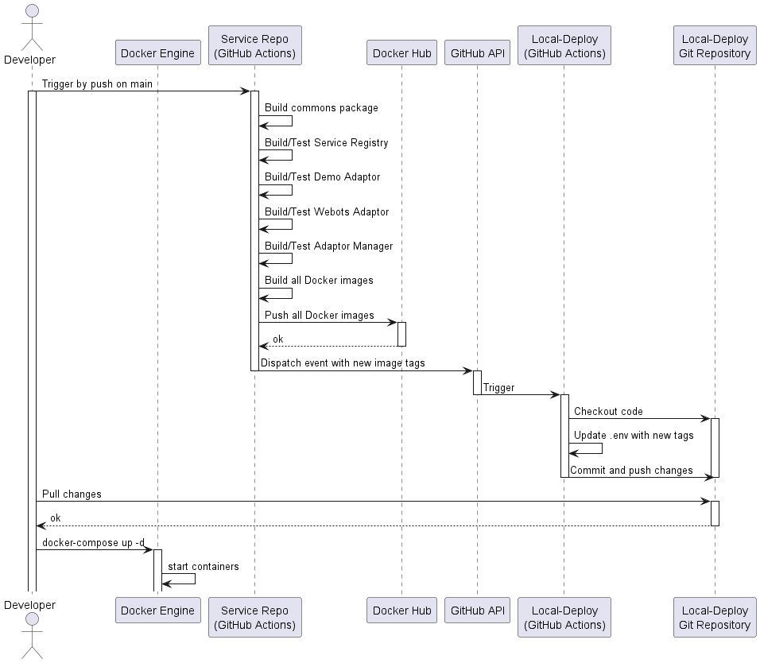
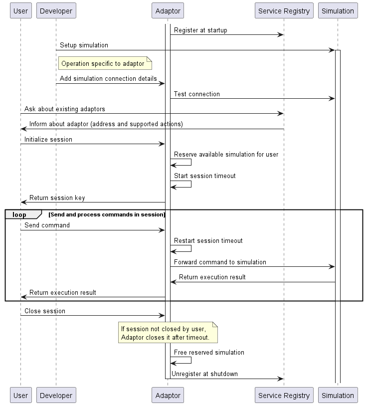

# project-management
Documentation and project-management related documents of the project.

## Continuous Integration
The CI workflow is depicted below. 
For deployment, check out the [local-deploy](https://github.com/jku-swe-simcomp/local-deploy)

## Use Cases
An overview of the use cases can be found  [here](use-cases/overview.md).

## Architecture

## Adaptor Lifecycle
The lifecycle of an adaptor is depicted below.

## Simulation Session
The happy path of a simulation session is depicted below.

